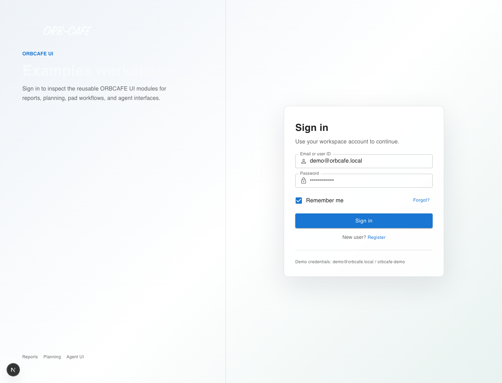

# ORBCAFE UI

ORBCAFE UI is a React / Next.js enterprise UI library for building SAP-style business applications: standard reports, value help filters, planning Gantt boards, touch-first pad workflows, analytical pivot views, detail pages, Kanban boards, app shells, auth pages, and AI chat surfaces.

The library is designed for two audiences at once:

- Developers who want stable, typed public React components.
- AI coding agents that need clear module contracts, examples, and skills to generate working ORBCAFE screens without guessing internal APIs.



## License

ORBCAFE UI is **source-available** software under the [ORBCAFE UI Community License](LICENSE), with commercial licenses available for commercial product use.

Free for:

- Personal use, education, and research
- Development, testing, evaluation, and prototypes
- Internal business applications (ERP portals, dashboards, AI agents, internal tools — any company size)
- Community projects and free demos/templates

A commercial license is required when ORBCAFE UI is used in:

- Commercial SaaS or commercial software products
- Paid customer delivery projects (consulting, outsourcing, system integration)
- OEM / white-label products, redistribution, or resale
- Commercial templates and commercial UI libraries built on ORBCAFE UI
- Low-code / no-code platforms, UI builders, and design-system platforms

> **Build for yourself — free. Build software for customers — commercial license.**

For commercial licensing, see [COMMERCIAL_LICENSE.md](COMMERCIAL_LICENSE.md). Versions of ORBCAFE UI published before v3.0.0 remain available under the MIT License.

### 授权说明（中文摘要）

ORBCAFE UI 采用 **Community License + Commercial License** 双授权模式。对个人使用、学习教育、开发测试、企业内部应用以及社区项目免费；当 ORBCAFE UI 成为商业 SaaS、商业软件产品、收费客户项目交付、OEM / White Label、商业模板、UI Builder / Low-Code 产品的一部分，或被再发行、二次销售时，需要取得商业授权。原则很简单：**给自己或自己公司做 — 免费；给客户做软件 — 需要商业授权。**

## Highlights

| Area | What you get |
| --- | --- |
| App shell | `CAppPageLayout`, `NavigationIsland`, locale switcher, user menu, logo slot, route-safe page transitions. |
| Standard report | `CStandardPage`, `CSmartFilter`, `CTable`, variants, layouts, quick create/edit/delete, pagination, and SAP-style `CValueHelp`. |
| Planning | `CPlanningLayout` / `CPlanningGantt` with table + timeline panes, row reorder, page-size selector, equal 50/50 split toggle, and manual drag resizing. |
| Analytics | `CPivotTable`, pivot chart companion views, draggable rows/columns/filters/values, aggregations, and presets. |
| Workflow pages | `CKanbanBoard`, `CDetailInfoPage`, `CGraphReport`, and `CCustomizeAgent` for operational work surfaces. |
| Pad | `PAppPageLayout`, `PTable`, `PSmartFilter`, `PNumericKeypad`, `PBarcodeScanner` for touch-first warehouse and shop-floor scenarios. |
| AI surfaces | `StdChat`, `CopilotChat`, `AgentPanel`, dynamic markdown/cards rendering, voice navigation via `CAINavProvider`. |
| AI-ready docs | Skills under `skills/` route natural-language requests to canonical ORBCAFE modules and enforce examples-first integration. |

## Documentation Map

- [Official examples walkthrough](EXAMPLES.md): screenshots, routes, and key behavior for every example page.
- [Vibe coding and skills guide](VIBE_CODING.md): how to ask AI agents to use ORBCAFE UI, including `CValueHelp` and module skills.
- [Examples app README](guides/examples-app.md): how to run the Next.js examples locally.
- [AI module contracts](skills/orbcafe-ui-component-usage/references/module-contracts.md): public API, hook strategy, examples, validation, and troubleshooting index for agent use.
- Component docs:
  - [StdReport](components/StdReport.md)
  - [Molecules / CValueHelp](components/Molecules.md)
  - [Planning](components/Planning.md)
  - [Pad](components/Pad.md)
  - [AgentUI](components/AgentUI.md)
  - [PageLayout](components/PageLayout.md)
  - [PivotTable](components/PivotTable.md)
  - [DetailInfo](components/DetailInfo.md)
  - [Kanban](components/Kanban.md)

## Install

> Upgrading from v1? Version 2 was a breaking MUI-to-ORBIS migration — follow the [v2 migration guide](guides/v2-migration.md) first. Version 3 keeps the v2 API; the major bump marks the switch from MIT to the Community License (see [License](#license)).

Install the package. `orbcafe-ui@3` is **MUI-free** — the runtime dependencies (Radix primitives, `class-variance-authority`, `tailwind-merge`, `clsx`, `dayjs`, ...) ship with the package, so you do **not** need `@mui/*`, `@emotion/*`, or `lucide-react`:

```bash
npm install orbcafe-ui
```

Tailwind v4 is required to compile the utility classes used by the components:

```bash
npm install -D tailwindcss @tailwindcss/postcss
```

Brand theming is optional. The default ORBIS theme and packaged theme overrides
work without Open Design; see [guides/brand-theming.md](guides/brand-theming.md) for built-in
packs and the optional `orbcafe-theme` CLI workflow.

## Required App Setup

### Tailwind source scanning

ORBCAFE UI components rely on Tailwind utility classes. The published `dist/index.css` is not enough by itself; your app must scan the library output.

Tailwind v4 / Next.js baseline:

```css
@import "tailwindcss";
@import "orbcafe-ui/styles.css"; /* ORBIS 自写样式（orb-* 类 + 暗色变量），必须引入一次 */
@source "../node_modules/orbcafe-ui/dist";
```

When developing inside this repo, the examples app also scans the source package:

```css
@source "../../src";
```

### Providers

Mount `GlobalMessage` once at the application layer. Add `OrbisModeProvider` there when standalone ORBCAFE surfaces or the host design system share the same mode. V2 is MUI-free, so there is no ORBCAFE requirement for MUI `ThemeProvider`, `CssBaseline`, or `LocalizationProvider`:

```tsx
'use client';

import { GlobalMessage, OrbisModeProvider, OrbcafeI18nProvider } from 'orbcafe-ui';

export function Providers({ children }: { children: React.ReactNode }) {
  return (
    <OrbisModeProvider mode="system">
      <OrbcafeI18nProvider locale="en">
        {children}
        <GlobalMessage />
      </OrbcafeI18nProvider>
    </OrbisModeProvider>
  );
}
```

> `CAppPageLayout` / `PAppPageLayout` render their own `OrbisModeProvider`, but `GlobalMessage` must be mounted once by the host. `CAppPageLayout` supports controlled `mode` / `onModeChange` for synchronizing another design system. Dark mode is applied automatically by toggling the `orb-dark` class on `<html>`.

## Run The Official Examples

```bash
npm run build

cd examples
npm install
npm run dev
```

Open `http://localhost:3000`.

Main routes:

| Route | Demonstrates |
| --- | --- |
| `/` | Navigation island and base button states. |
| `/std-report` | Standard report, i18n, `CSmartFilter`, `CTable`, variants/layouts, quick create, and `CValueHelp`. |
| `/planning` | Production planning Gantt with many columns, page-size selector, 50/50 split toggle, and manual resizing. |
| `/kanban` | Drag/drop workflow board and card-to-detail navigation. |
| `/pivot-table` | Pivot fields, aggregations, chart views, and preset persistence. |
| `/detail-info/ID-1` | Detail page with sections, tabs, related table, search, and AI fallback. |
| `/pad` | Touch-first warehouse workload, pad table, keypad, and scanner flow. |
| `/chat` | Full-page `StdChat` with markdown, math, code, Mermaid, and dynamic cards. |
| `/copilot` | Floating draggable/resizable `CopilotChat`. |
| `/aipanel` | Display-only `AgentPanel` with status states. |
| `/ai-nav` | Space-key voice navigation provider and hook state. |

## CValueHelp Quick Start

Use `CValueHelp` directly for standalone form fields, or configure it through `CSmartFilter` / `PSmartFilter` so value selection is preserved in filter and variant state.

```tsx
{
  id: 'customer',
  label: 'Customer',
  type: 'value-help',
  valueHelp: {
    dialogTitle: 'Customer Value Help',
    items: customers,
    columns: [
      { field: 'customerId', label: 'Customer', minWidth: 120 },
      { field: 'customerName', label: 'Name', minWidth: 220 },
      { field: 'country', label: 'Country', minWidth: 90 },
    ],
    getOptionValue: (item) => item.customerId,
    getOptionLabel: (item) => item.customerName,
    getOptionDescription: (item) => item.country,
  },
}
```

Rules:

- Store stable keys as values, not localized labels.
- Single selection maps to `equals`.
- Multiple selection maps to `anyOf`.
- Use `onSearch(query)` for remote search help.
- In reports/planning/pad filters, prefer SmartFilter field config over a separate custom lookup dialog.

See [Vibe coding and skills guide](VIBE_CODING.md#cvaluehelp-f4--value-help) for AI-agent usage rules.

## AI / Vibe Coding Baseline

When using Codex or another AI coding agent with ORBCAFE UI, ask it to follow the local skills instead of inventing component APIs:

1. Route the request through `skills/orbcafe-ui-component-usage`.
2. Map natural names like "table", "F4", "pad table", "planning Gantt", or "copilot" to canonical exports.
3. Check the target module skill, for example `orbcafe-stdreport-workflow`, `orbcafe-cardpage-workflow`, `orbcafe-planning-gantt`, `orbcafe-pad-workflow`, or `orbcafe-agentui-chat`.
4. Import only from `orbcafe-ui`.
5. Validate against the official Next.js examples.

Two integration styles are used across the library:

- Hook-first: the module exposes a public hook that owns state and returns props for the standard component, for example `useStandardReport`, `usePlanningLayout`, `useKanbanBoard`, `usePivotTable`, and `usePadLayout`.
- Component-first: the module's stable contract is the component props and callbacks, for example `StdChat`, `CopilotChat`, and `AgentPanel`.

More detail: [VIBE_CODING.md](VIBE_CODING.md).

## Public API Rule

Application code should import only from the package entry:

```tsx
import {
  CStandardPage,
  CValueHelp,
  CPlanningLayout,
  CPivotTable,
  PTable,
  StdChat,
} from 'orbcafe-ui';
```

Do not import from `src/components/...` in consuming applications. Internal paths may change; public exports are the contract.

## Quality Checks

```bash
npm run build
cd examples && npm run build
npm run check:ai-contracts
```

Before publishing documentation screenshots, run the examples app and refresh the images under `images/examples/`.
